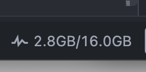

<div align="center">

# ⚡ OmniMem – IDE RAM Monitor

**Universal, lightweight real-time memory & process monitor for VS Code, Cursor, Windsurf, Antigravity IDE, Devin Desktop, Trae, VSCodium, and other forks.**

[](https://marketplace.visualstudio.com/items?itemName=SergioSuarezGil.omnimem)
[](LICENSE)
[]()
[]()
[](https://marketplace.visualstudio.com/items?itemName=SergioSuarezGil.omnimem)
[](https://open-vsx.org/extension/SergioSuarezGil/omnimem)
[](https://github.com/SergioSuarezGil/OmniMem-IDE-RAM-Monitor/releases)

</div>

---

## 📖 Overview

**OmniMem** displays the real RAM usage of your editor runtime (Main process, Renderers, GPU, Extension Host, and Helpers) directly in your status bar. It also scans your installed extensions folder to find duplicate versions lingering on disk.

Unlike existing memory monitors that hardcode binary names (breaking as soon as you switch to **Cursor**, **Windsurf**, **Antigravity IDE**, or **Devin**), **OmniMem** is designed from the ground up to be **100% fork-agnostic**.

---

## 📸 Screenshots

<div align="center">
  <p><em>Status bar preview showing real-time memory consumption:</em></p>
  
</div>

---

## ✨ Features

- **⚡ Real-Time RAM in Status Bar**: Sums the exact Resident Set Size (RSS / Working Set) of all processes belonging to this editor instance.
- **🎨 Configurable Display Formats**: Choose how memory is formatted (`used/total`, `usedOnly`, `percentage`, or `compact`).
- **🔍 Duplicate Extension Detector**: Scans your active editor's extensions directory and reports extensions with multiple leftover versions on disk.
- **🚀 Zero Runtime Dependencies**: Pure Node.js & VS Code API with zero bloat (< 10 KB footprint).
- **🔄 Live Hot-Reloading**: Configuration changes (refresh interval, format) apply immediately without restarting the editor.
- **🛠️ Click-to-Refresh**: Click the status bar item anytime to force an instant memory refresh.

---

## 🌐 Supported Editors

Works seamlessly across all modern Electron / VS Code-based editors:

| Editor                 | Platform Support        | Status       |
| :--------------------- | :---------------------- | :----------- |
| **Visual Studio Code** | macOS / Linux / Windows | Full Support |
| **Cursor**             | macOS / Linux / Windows | Full Support |
| **Windsurf**           | macOS / Linux / Windows | Full Support |
| **Antigravity IDE**    | macOS / Linux / Windows | Full Support |
| **Devin Desktop**      | macOS / Linux / Windows | Full Support |
| **Trae**               | macOS / Linux / Windows | Full Support |
| **VSCodium**           | macOS / Linux / Windows | Full Support |
| **Positron**           | macOS / Linux / Windows | Full Support |

---

## ⚙️ Configuration

You can customize **OmniMem** via your editor's `settings.json` or through the Settings UI (`OmniMem`):

| Setting                           | Type     | Default        | Description                                                                                                                                                                            |
| :-------------------------------- | :------- | :------------- | :------------------------------------------------------------------------------------------------------------------------------------------------------------------------------------- |
| `memoryMonitor.displayFormat`     | `string` | `"used/total"` | Format for the status bar. Options: <br>• `"used/total"` &rarr; `1.5GB/16.0GB`<br>• `"usedOnly"` &rarr; `1.5GB`<br>• `"percentage"` &rarr; `9.4%`<br>• `"compact"` &rarr; `1.5GB (9%)` |
| `memoryMonitor.refreshIntervalMs` | `number` | `5000`         | Refresh frequency in milliseconds (minimum: `1000`).                                                                                                                                   |

---

## ⌨️ Commands

Access these commands from the Command Palette (`Cmd+Shift+P` on macOS, `Ctrl+Shift+P` on Windows/Linux):

- `OmniMem: Refresh Memory Usage` &mdash; Instantly recalculates and updates the status bar.
- `OmniMem: Check Duplicate Extensions` &mdash; Checks your extensions folder for duplicate installed versions and opens a summary report.

---

## 🧠 How It Works (Under the Hood)

OmniMem identifies processes using runtime introspection rather than hardcoded process names:

- **macOS**: Electron ships helper processes (Renderer, GPU, Plugin Host) as sub-bundles inside the main `.app` bundle. OmniMem inspects `process.execPath`, resolves the `.app` root, and sums the RSS of all child processes running under that bundle root.
- **Linux**: Electron launches child processes from the main binary path with `--type=...` parameters. OmniMem tracks all processes matching the exact `execPath`.
- **Windows**: Queries process working sets via `Get-CimInstance Win32_Process` matching the active `ExecutablePath`.
- **Duplicate Detection**: Uses `path.dirname(context.extensionPath)` to automatically point to the current editor's extension storage (`~/.cursor/extensions`, `~/.windsurf/extensions`, `~/.vscode/extensions`, etc.).

> **Note on external tools**: OmniMem tracks all processes managed by the editor application. External CLI tools and compilers installed globally on the system (outside the editor bundle) are not included.

---

## 📦 Installation

### Marketplace Links

- VS Code Marketplace: https://marketplace.visualstudio.com/items?itemName=SergioSuarezGil.omnimem
- Open VSX Registry: https://open-vsx.org/extension/SergioSuarezGil/omnimem
- GitHub Releases (VSIX): https://github.com/SergioSuarezGil/OmniMem-IDE-RAM-Monitor/releases

### From GitHub Releases (recommended)

1. Open the repository Releases section.
2. Download the `.vsix` attached to the version you want (for example `omnimem-x.y.z.vsix`).
3. Install it from your editor UI (_Extensions -> Install from VSIX..._) or with CLI.

### From VSIX Package

1. Package or download the `.vsix` file:
   ```bash
   npm run package
   ```
2. Install it in your editor of choice via CLI or through the UI (_Extensions &rarr; Install from VSIX..._):

```bash
# VS Code
code --install-extension omnimem-x.y.z.vsix

# Cursor
cursor --install-extension omnimem-x.y.z.vsix

# Windsurf
windsurf --install-extension omnimem-x.y.z.vsix

# Antigravity IDE
antigravity-ide --install-extension omnimem-x.y.z.vsix

# Devin Desktop
devin-desktop --install-extension omnimem-x.y.z.vsix
```

---

## 🚀 Release Process

Development follows a lightweight Git Flow: feature branches are integrated into `develop`, releases are prepared locally, and only the maintainer promotes `develop` to `main`.

### Required repository secrets

- `VSCE_PAT`: Personal Access Token for VS Code Marketplace publishing.
- `OVSX_PAT`: Personal Access Token for Open VSX publishing.

### Preparing and publishing a release

Run the release script from a clean `develop` branch:

```bash
# Infer patch, minor, or major from commits since the latest version tag
npm run release

# Optionally request an equal or higher version increment
npm run release -- minor
```

The script verifies the branch history, runs tests, packages the extension, updates the version, and generates `CHANGELOG.md`. It does not commit, tag, push, merge, or publish anything.

After reviewing and committing the generated files, push `develop` and merge it into `main`. A push to `main` runs `.github/workflows/release.yml`, which validates the prepared version, publishes to both marketplaces, and creates the tag and GitHub Release.

### About VS Code Marketplace vs other editors

- **VS Code / Cursor / Windsurf / Antigravity IDE / Devin / Trae**: many forks can install VSIX directly, and some also consume Marketplace-compatible sources.
- **VSCodium** usually relies on **Open VSX**, not Microsoft Marketplace.
- Publishing to both **VS Code Marketplace** and **Open VSX** maximizes compatibility and avoids manual duplication.

## 🛠️ Development & Testing

### Prerequisites

- Node.js 20 or later. If you use `nvm`, run `nvm use` from the repository root.

```bash
# Install dependencies
npm install

# Run unit test suite
npm test

# Run tests with code coverage report
npm run test:coverage

# Build VSIX package
npm run package
```

### Commit types and release impact

The release process uses Conventional Commit types to determine whether a new version is required and which version component to increment.

| Commit type | Release impact |
| --- | --- |
| `feat:` | Minor |
| `fix:` | Patch |
| `perf:` | Patch |
| `refactor:` | Patch |
| `feat!:` or `BREAKING CHANGE:` | Major |
| `docs:` | No release |
| `test:` | No release |
| `ci:` | No release |
| `chore:` | Patch |
| `style:` | No release |
| `infra:` | No release |

Add `[skip release]` to a commit message when a normally publishable change should not create a new release:

```text
fix: adjust development-only diagnostics [skip release]
```

---

## 📄 License

MIT © 2026
